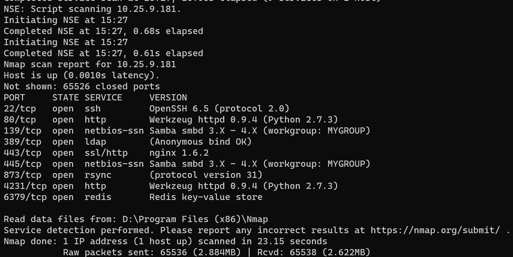

# 命令行操作和管理脚本示例

## 前言
> 资产脚本输出格式支持：直接打印、txt文本、csv表格、json文本、xml文本。资产内容的数据暂定包含：时间戳、IP、OS、端口、协议、服务指纹，其中UDP端口的服务指纹暂不支持。

--------------------------------------------------------

- 第一阶段只有两个接口，一个是存活，一个是端口服务发现。
  - 1. 存活的接口
  - 2. 关于端口发现和服务指纹两个接口输入很接近。输出的话服务指纹更详细，多了指纹。
  
  
## 1. 资产存活接口 【脚本】
### 命令行接口
```bash 

AssetDetection \
    --type alive \
    --targets 192.168.0.0/24 \
    --targets-type string \
    --alive-type 0 \
    --timeout 30 \
    --output result.txt 

```

### 输入参数

 输出参数| 描述 | 示例
 --- | --- |  --- 
 type | 接口类型 |  枚举存活、
 targets | 扫描目标 |  192.168.33.0-192.168.33.125, 10.0.0.0/8|
targets-type | 输入目标类型 | string、file 枚举字符串和文件
alive-type | 存活检测类型 | 1，2，3
output | 输出位置 | 存储报告的路径

- 存活检测类型补充说明
  - 1. icmp 发现
  - 2. tcp syn 扫描发现
  - 3. tcp ack 扫描发现
  - ... 

### 输出参数
 输出参数| 描述 | 示例
 --- | --- |  --- 
 target |资产IP | 192.168.33.22 (ipv4/ipv6)
 mac |资产MAC | ff-ff-ff-ff-ff-ff
 ventor |所属厂商 | 华为、vmware/qemu虚拟机
 discover_time|发现时间 | 2020-12-31 11:12:13
 alive | 存活  | 0/1 枚举，存活是1 
 task_id | 任务ID | `<uuid>`
 
 ## 2. 资产端口快速发现 【脚本】
### 命令行接口
```bash
AssetDetection \
    --type portscan \
    --targets 192.168.0.0/24 \
    --targets-type string \
    --ports 1-65535 \
    --protocol tcp \
    --exclude-targets 192.168.0.255 \
    --exclude-targets-type string \ 
    --timeout 30 
    --output /tmp/xscan/service-con.xml  
```

### 输入参数

 输出参数| 描述 | 示例
 --- | --- |  --- 
 type | 接口类型 |  端口发现
 targets | 扫描目标 |  192.168.33.0-192.168.33.125, 10.0.0.0/8|
targets-type | 输入目标类型 | string、file 枚举字符串和文件
ports | 端口集合 | 1-65535(默认),[21,22,80,139,445...],top-1000
protocol | 扫描协议 | 默认tcp/udp
exclude-targets | 忽略目标的列表 | 输入类型同扫描目标
exclude-targets-type | 忽略目标的列表类型 | 输入类型同扫描目标
timeout | 超时设置 | 超过timeout数值的连接就算不存在
output | 输出路径 | /data/scan_result/<uuid>.xml
 task_id | 任务ID | `<uuid>`
 report_id | 
 
### 输出 xml 格式
- 涵盖了 os、mac、port、protocol, service, service-version、discover_time 信息

**xml中字段要素**

 输出参数| 描述 | 示例
 --- | --- |  --- 
 target |资产IP | 192.168.33.22 (ipv4/ipv6)
 mac |资产MAC | ff-ff-ff-ff-ff-ff
 ventor |所属厂商 | 华为、vmware/qemu虚拟机
 discover_time|发现时间 | 2020-12-31 11:12:13
 alive | 存活  | 0/1 枚举，存活是1 
 port | 端口  | 80,443,3306...
 status | 端口开放状态  | open/close/establish...
 protocol | 协议  | tcp/udp
 service | 服务  | tcp下面应用协议的服务类型
 service-version | 服务指纹  | 提供应用层服务的服务端版本




- [xml路径示例文件下载](./images/result-demo.xml)


## 3. 资产服务扫描 【脚本】
### 命令行接口
```bash
AssetDetection \
    --type sertron \
    --targets 192.168.0.0/24 \
    --targets-type string \
    --ports 1-65535 \
    --protocol tcp \
    --exclude-targets 192.168.0.255 \
    --exclude-targets-type string \ 
    --timeout 30 
    --output /tmp/xscan/service-con.xml  

```

### 输入参数

 输出参数| 描述 | 示例
 --- | --- |  --- 
 type | 接口类型 |  服务指纹
 targets | 扫描目标 |  192.168.33.0-192.168.33.125, 10.0.0.0/8|
targets-type | 输入目标类型 | string、file 枚举字符串和文件
ports | 端口集合 | 1-65535(默认),[21,22,80,139,445...],top-1000
protocol | 扫描协议 | 默认tcp/udp
exclude-targets | 忽略目标的列表 | 输入类型同扫描目标
exclude-targets-type | 忽略目标的列表类型 | 输入类型同扫描目标
timeout | 超时设置 | 超过timeout数值的连接就算不存在
output | 输出路径 | /data/scan_result/<uuid>.xml


### 输出 xml 格式
- 涵盖了 os、mac、port、service, service-version、discover_time 信息

## 后记
 - 报告2
    - `nmap -sS -sV -v -p- --host-timeout 3 -oX test.xml 10.27.106.0/24` 